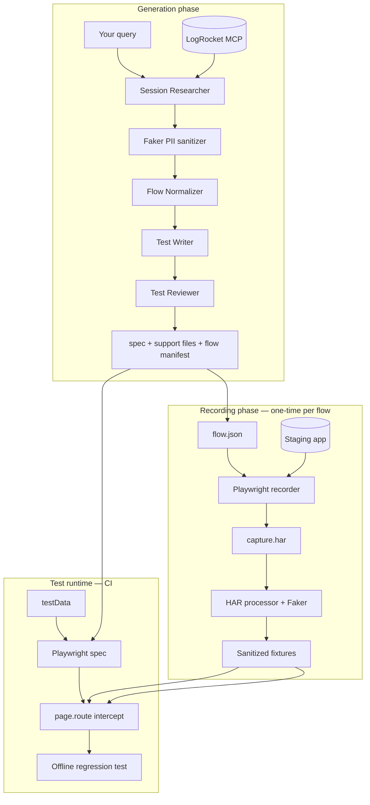
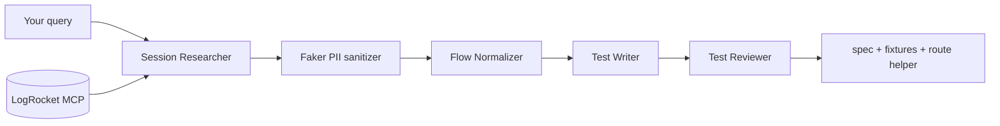
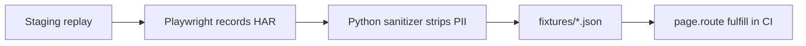

# E2E Regression Tests from LogRocket Flows

A guide to generating Playwright e2e regression tests from real LogRocket user sessions, using local Qwen models, the OpenAI Agents SDK, Faker-based PII sanitization, and Playwright route interception.

---

## Table of contents

1. [Overview](#overview)
2. [How it works](#how-it-works)
3. [Prerequisites](#prerequisites)
4. [Installation](#installation)
5. [Configuration](#configuration)
6. [Commands](#commands)
7. [End-to-end workflow](#end-to-end-workflow)
8. [Multi-agent pipeline](#multi-agent-pipeline)
9. [PII safety](#pii-safety)
10. [API fixture recording (HAR)](#api-fixture-recording-har)
11. [Generated output structure](#generated-output-structure)
12. [Playwright integration](#playwright-integration)
13. [Model recommendations](#model-recommendations)
14. [LogRocket MCP setup](#logrocket-mcp-setup)
15. [CI integration](#ci-integration)
16. [Extending the system](#extending-the-system)
17. [Alternatives](#alternatives)
18. [Troubleshooting](#troubleshooting)

---

## Overview

This tool connects three systems:

| Component | Role |
|-----------|------|
| **LogRocket MCP** | Pulls real user session replays (`find_sessions`, `watch_sessions`) |
| **Local Qwen (Ollama/vLLM)** | Generates Playwright test code via OpenAI-compatible API |
| **OpenAI Agents SDK** | Orchestrates multiple specialized agents (research → normalize → write → review) |

The result is committed Playwright tests that reproduce real user flows — without leaking production PII.

---

## How it works



**The closed loop:**

1. LogRocket tells you **which user flow** broke or matters
2. Agents generate the **UI steps** as a Playwright test
3. HAR capture gives you the **API contract** for that flow (from staging)
4. Faker sanitization makes everything **safe to commit**
5. CI runs tests **fully offline** with real response structures

---

## Prerequisites

### Required

- **Python 3.10+**
- **LogRocket account** with MCP access
- **Ollama 0.12+** (or vLLM) with a tool-calling coder model
- **Node.js** (for `record-fixtures` and running Playwright tests)

### Recommended local model

```bash
ollama pull qwen3-coder:30b

# Verify tool-calling support:
ollama show qwen3-coder:30b | grep -i capabilities
```

Prefer **`qwen3-coder`** over `qwen2.5-coder` — tool calling is more reliable with the OpenAI Agents SDK.

---

## Installation

```bash
cd e2e-from-logrocket
python -m venv .venv
source .venv/bin/activate   # Windows: .venv\Scripts\activate
pip install -e .

cp .env.example .env
# Edit .env with your LogRocket and staging credentials
```

---

## Configuration

Copy `.env.example` to `.env` and fill in:

### LogRocket (required for `generate`)

| Variable | Description |
|----------|-------------|
| `LOGROCKET_API_KEY` | Project-scoped API key from **Settings → API Keys** |
| `LOGROCKET_ORG_ID` | Organization ID (from LogRocket URLs or project settings) |
| `LOGROCKET_PROJECT_ID` | Project ID |

OAuth works in Cursor/Claude Desktop, but headless scripts require an API key.

### Local LLM

| Variable | Default | Description |
|----------|---------|-------------|
| `OLLAMA_BASE_URL` | `http://localhost:11434/v1` | OpenAI-compatible endpoint |
| `OLLAMA_MODEL` | `qwen3-coder:30b` | Model name |

For vLLM: `OLLAMA_BASE_URL=http://localhost:8000/v1`

### Output

| Variable | Default | Description |
|----------|---------|-------------|
| `E2E_OUTPUT_DIR` | `./generated-tests` | Where tests and fixtures are written |

### PII safety

| Variable | Default | Description |
|----------|---------|-------------|
| `PII_SANITIZE` | `true` | Enable Faker redaction at generation time |
| `FAKER_SEED` | `42` | Deterministic fake data across runs |
| `SOURCE_ENV` | `production` | Hint to agents about session origin |

Set `PII_SANITIZE=false` only for staging sessions with no real user data.

### Fixture recording

| Variable | Default | Description |
|----------|---------|-------------|
| `STAGING_BASE_URL` | *(required for record-fixtures)* | e.g. `https://staging.yourapp.com` |
| `PLAYWRIGHT_BROWSER` | `chromium` | Browser for HAR capture |

---

## Commands

### Web dashboard (local UI)

There is **no hosted UI** — everything runs on your machine. A local Streamlit dashboard is included:

```bash
pip install -e ".[dashboard]"
e2e-dashboard
```

Opens at `http://localhost:8501` with:

| Page | What it does |
|------|----------------|
| **Overview** | Explains the agent pipeline + env health |
| **Flows** | Lists generated flows, steps, mock status |
| **Generate** | Kick off LogRocket → Playwright pipeline from a query |
| **Record fixtures** | Run HAR capture against staging (or upload a HAR) |
| **Flow detail** | Inspect `flow.json`, specs, fixtures, test data |

### Generate tests from LogRocket

```bash
# Subcommand form
e2e-from-logrocket generate "Find signup sessions from last week where users completed onboarding"

# Legacy form (query as positional arg)
e2e-from-logrocket "Find checkout abandon sessions from the last 7 days"
```

### Record staging API fixtures

```bash
# Replay flow on staging, capture HAR, write sanitized fixtures
e2e-from-logrocket record-fixtures checkout-happy-path

# Process an existing HAR file instead
e2e-from-logrocket record-fixtures checkout-happy-path --har ./my-capture.har
```

### Run generated tests

```bash
cd generated-tests
npm install          # first time only
npx playwright install chromium
npx playwright test
```

---

## End-to-end workflow

```bash
# 1. Generate test + flow manifest from LogRocket production sessions
e2e-from-logrocket generate "checkout abandon sessions last 7 days"

# 2. Record real API response shapes from staging (one-time per flow)
e2e-from-logrocket record-fixtures checkout-happy-path

# 3. Run tests in CI — fully offline with sanitized fixtures
cd generated-tests && npx playwright test
```

---

## Multi-agent pipeline

Four agents run sequentially, each with a narrow job (local models perform better this way):

| Agent | MCP tools? | Responsibility |
|-------|------------|----------------|
| **Session Researcher** | Yes (LogRocket) | `find_sessions` + `watch_sessions`; extracts user actions, DOM hints, API paths |
| **Flow Normalizer** | No | Converts narrative → structured JSON steps + API mock hints |
| **Test Writer** | No | Emits Playwright TypeScript using `testData` and route helpers |
| **Test Reviewer** | No | Catches brittle selectors, missing assertions, hardcoded PII |



Only the Session Researcher needs MCP access. The other agents work on structured text/JSON.

---

## PII safety

Production LogRocket sessions contain real user data. This system uses **two layers** of protection:

### Layer 1: Generation time (Python + Faker)

Runs after session research, before tests are written:

- Regex-detects emails, phones, SSNs, credit cards, UUIDs, IPs in session text
- Replaces them with **deterministic** Faker values (`FAKER_SEED` keeps runs stable)
- Builds a `testData` object (`email`, `firstName`, `password`, etc.)
- Rewrites `fill` step values to use synthetic data

Detected patterns include:

- Email addresses
- Phone numbers (US formats)
- SSN (`###-##-####`)
- Credit card numbers
- UUIDs
- IP addresses

### Layer 2: Test runtime (Playwright `page.route()`)

Generated tests import `setupPiiSafeRoutes()` from `support/pii-routes.ts`:

| Mode | When | Behavior |
|------|------|----------|
| **fulfill** | Fixture file exists for matched route | Returns sanitized JSON fixture — test runs offline |
| **transform** | Fallback `**/api/**` mock | Fetches live response, redacts PII in body, fulfills modified response |

Example generated test pattern:

```typescript
import { test, expect } from '@playwright/test';
import { testData } from '../support/checkout-happy-path.test-data';
import { setupPiiSafeRoutes } from '../support/pii-routes';

test.describe('checkout happy path', () => {
  test.beforeEach(async ({ page }) => {
    await setupPiiSafeRoutes(page, 'checkout-happy-path');
  });

  test('user completes checkout', async ({ page }) => {
    await page.goto('/checkout');
    await page.getByLabel('Email').fill(testData.email);
    await page.getByLabel('Card number').fill('4111111111111111'); // test card, not production
    // ...
  });
});
```

**Rule:** Generated tests never hardcode production emails, names, or account IDs.

---

## API fixture recording (HAR)

Hand-written API fixtures are tedious. Guessing response shapes from session narratives is unreliable. HAR recording bridges the gap.

### Why record fixtures?

| Approach | Pros | Cons |
|----------|------|------|
| **Transform live responses** | Safe, no fixture maintenance | Tests still hit real APIs; shape unknown |
| **Hand-written fixtures** | Fully offline | Manual work; may not match real API |
| **HAR recording (this tool)** | Real API shapes; sanitized; offline in CI | One-time staging replay per flow |

### What `record-fixtures` does

1. Replays UI steps from `fixtures/<flow>/flow.json` against `STAGING_BASE_URL` (no mocks)
2. Records API traffic to `fixtures/<flow>/capture.har` via Playwright (`urlFilter: /\/api\//`)
3. Matches HAR entries to URL patterns in `api-mocks.json`
4. Sanitizes response bodies with Faker
5. Writes `fixtures/<flow>/*.json`
6. Updates `api-mocks.json`: flips `transformResponse: true` → `false`, sets HTTP status from capture

### Process an existing HAR

If you already have a HAR from browser DevTools or another tool:

```bash
e2e-from-logrocket record-fixtures checkout-happy-path --har ./my-capture.har
```

### Recording flow diagram



---

## Generated output structure

After `generate`:

```
generated-tests/
├── checkout-happy-path.spec.ts       # Playwright regression test
├── package.json                      # Created on first record-fixtures run
├── playwright.config.ts              # baseURL from STAGING_BASE_URL
├── support/
│   ├── pii-routes.ts                 # page.route() intercept + redactPii()
│   ├── checkout-happy-path.test-data.ts  # Faker-generated synthetic values
│   ├── record-flow.ts                # Replays flow + records HAR
│   └── record-flow.spec.ts           # Recorder test (@recorder)
└── fixtures/
    └── checkout-happy-path/
        ├── flow.json                 # Normalized UI steps (for recording replay)
        ├── api-mocks.json            # Route manifest (method, urlPattern, fixtureFile)
        ├── capture.har               # Raw staging capture (optional to gitignore)
        └── users-profile.json        # Sanitized API fixture body
```

### Key files explained

| File | Purpose |
|------|---------|
| `flow.json` | Structured steps the recorder replays on staging |
| `api-mocks.json` | Which API routes to mock/transform during tests |
| `*.test-data.ts` | Synthetic form-fill values (committed safely) |
| `pii-routes.ts` | Shared Playwright route interceptor |
| `capture.har` | Raw network log from staging (may contain PII — consider gitignoring) |

---

## Playwright integration

### Route matching

Mocks in `api-mocks.json` use glob-style patterns:

```json
{
  "flowName": "checkout-happy-path",
  "mocks": [
    {
      "method": "GET",
      "urlPattern": "**/api/users/profile*",
      "fixtureFile": "users-profile.json",
      "status": 200,
      "transformResponse": false
    }
  ]
}
```

### `setupPiiSafeRoutes(page, flowName)`

Called in `test.beforeEach`. For each request:

1. Check if URL + method match a mock in the manifest
2. If `transformResponse: true` → fetch live, redact JSON, fulfill
3. If fixture file exists → fulfill with fixture body
4. Otherwise → `route.continue()` (pass through)

### Recorder (`record-flow.spec.ts`)

Run with `FLOW_NAME` set (the CLI does this automatically):

```bash
FLOW_NAME=checkout-happy-path STAGING_BASE_URL=https://staging.example.com \
  npx playwright test support/record-flow.spec.ts --grep @recorder
```

---

## Model recommendations

| Model | VRAM | Tool calling | Code quality | Recommendation |
|-------|------|--------------|--------------|----------------|
| `qwen3-coder:30b` | ~24GB | Excellent | High | **Default** |
| `qwen3-coder:14b` | ~12GB | Good | Good | Tighter hardware |
| `qwen2.5-coder` | Varies | Unreliable | Good | Avoid for agent loops |
| `qwen3:8b` | ~8GB | Good | Moderate | MCP only, not codegen |

**Tips:**

- Tool calling is required for the Session Researcher agent
- Smaller models struggle with long MCP + codegen chains — the pipeline splits roles to mitigate this
- Use `FAKER_SEED` for reproducibility; the LLM may still vary slightly between runs

---

## LogRocket MCP setup

### MCP server URL

```
https://mcp.logrocket.com/mcp/{org_id}/{project_id}?toolsets=sessions
```

The `sessions` toolset exposes:

| Tool | Description |
|------|-------------|
| `find_sessions` | Filter sessions by user, URL, time range, events |
| `watch_sessions` | Analyze and extract details from specific sessions |

### Authentication options

**OAuth** — works in Cursor, Claude Desktop, Claude Code. Best for interactive use.

**API key** — required for headless/server scripts:

```json
{
  "mcpServers": {
    "logrocket": {
      "url": "https://mcp.logrocket.com/mcp",
      "headers": {
        "Authorization": "Bearer <your-api-key>"
      }
    }
  }
}
```

Create keys in LogRocket: **Settings → API Keys** (project-scoped).

### Example queries

```
"User X reported a checkout problem — watch their sessions and find the root cause"

"Find signup sessions from last week where users completed onboarding"

"Look at new issues from the past week and suggest which ones need regression tests"

"How are users interacting with the search feature before I refactor it?"
```

Docs: [LogRocket MCP](https://docs.logrocket.com/docs/mcp)

---

## CI integration

### Suggested pipeline

```yaml
# .github/workflows/e2e-regression.yml
jobs:
  e2e:
    runs-on: ubuntu-latest
    steps:
      - uses: actions/checkout@v4
      - uses: actions/setup-node@v4
        with:
          node-version: 20
      - run: npm ci
        working-directory: generated-tests
      - run: npx playwright install --with-deps chromium
        working-directory: generated-tests
      - run: npx playwright test
        working-directory: generated-tests
```

### Generating tests on new LogRocket issues

Future automation idea:

1. Webhook or scheduled job detects new LogRocket issue
2. Runs `e2e-from-logrocket generate "issue: {title} — watch affected sessions"`
3. Runs `record-fixtures` against staging
4. Opens PR with generated test + fixtures

---

## Extending the system

### Selector mapper agent

Add an agent that reads your app's `data-testid` conventions and maps LogRocket DOM hints to stable selectors.

### Parallel flow miners

Run multiple Session Researchers on different segments (mobile vs desktop, error vs happy path), then merge flows.

### Custom PII field map

Extend `apply_test_data_to_flow()` in `src/e2e_from_logrocket/pii/sanitizer.py` with app-specific field labels (`member_id`, `policy_number`, etc.).

### Runtime Faker in Playwright

Add `@faker-js/faker` if you want unique data per run. Deterministic `testData` is usually better for regression tests.

### Cypress instead of Playwright

Swap Test Writer agent instructions to emit Cypress syntax.

---

## Alternatives

### Cursor SDK + LogRocket MCP

If you want repo-aware agents that edit your codebase directly in Cursor:

- Use the [Cursor SDK](https://cursor.com/docs/sdk) with LogRocket MCP inline
- Better for interactive debugging and opening PRs
- Uses Cursor models, not local Qwen

### OpenAI Agents SDK + hosted models

Replace `OpenAIChatCompletionsModel` pointing at Ollama with OpenAI/Anthropic models for higher quality at API cost.

---

## Troubleshooting

### `qwen2.5-coder` returns empty tool calls

Switch to `qwen3-coder`. Verify with `ollama show <model> | grep -i capabilities`.

### Session Researcher fails to connect to LogRocket MCP

- Check `LOGROCKET_API_KEY` is project-scoped and not expired
- Verify `LOGROCKET_ORG_ID` and `LOGROCKET_PROJECT_ID` match your dashboard URLs

### `record-fixtures` can't find `flow.json`

Run `generate` first. The flow name must match the directory under `fixtures/`.

### No fixtures written after recording

- Confirm staging is reachable at `STAGING_BASE_URL`
- Check that the flow replays successfully (selectors may need tuning)
- Verify API calls match patterns in `api-mocks.json`
- Inspect `fixtures/<flow>/capture.har` manually

### Tests pass locally but fail in CI

- Ensure fixture files are committed (not gitignored)
- Confirm `api-mocks.json` has `transformResponse: false` after recording
- Check `playwright.config.ts` baseURL matches your test environment

### PII in committed files

- Never commit `capture.har` from production (add to `.gitignore`)
- Re-run with `PII_SANITIZE=true`
- Audit generated specs for hardcoded emails/names

---

## Project layout (source)

```
e2e-from-logrocket/
├── GUIDE.md                          # This file
├── README.md                         # Quick start
├── .env.example
├── pyproject.toml
└── src/e2e_from_logrocket/
    ├── cli.py                        # generate + record-fixtures commands
    ├── config.py                     # Settings loaders
    ├── pipeline.py                   # Multi-agent generation pipeline
    ├── agents.py                     # Agent definitions + instructions
    ├── schemas.py                    # Pydantic models (Flow, ApiMock, etc.)
    ├── models.py                     # Local LLM configuration
    ├── playwright_emitter.py         # Writes spec + support files
    ├── fixture_recorder.py           # HAR parsing + fixture writing
    ├── record_fixtures.py            # Orchestrates Playwright HAR capture
    └── pii/
        └── sanitizer.py              # Faker-based PII redaction
```
