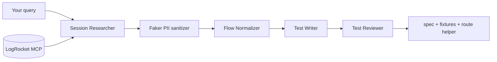

# E2E tests from LogRocket flows (local Qwen + OpenAI Agents SDK)

Turn real LogRocket session replays into Playwright regression tests using:

- **LogRocket MCP** (`find_sessions`, `watch_sessions`) for real user flows
- **Local Qwen** via Ollama's OpenAI-compatible API
- **OpenAI Agents SDK** multi-agent pipeline (research → normalize → write → review)

**Full documentation:** see [GUIDE.md](./GUIDE.md) for architecture, PII safety, HAR fixture recording, CI integration, and troubleshooting.

**Web dashboard:** `pip install -e ".[dashboard]"` then `e2e-dashboard` — local UI to generate flows, record fixtures, and inspect outputs.

## Prerequisites

1. LogRocket account with MCP access
2. [Ollama](https://ollama.com/) 0.12+ with a tool-calling coder model:

```bash
ollama pull qwen3-coder:30b
# verify tool support:
ollama show qwen3-coder:30b | grep -i capabilities
```

3. Python 3.10+

## Setup

```bash
cd e2e-from-logrocket
python -m venv .venv
source .venv/bin/activate
pip install -e .

cp .env.example .env
# Fill LOGROCKET_API_KEY, LOGROCKET_ORG_ID, LOGROCKET_PROJECT_ID
```

Create a project-scoped API key in LogRocket: **Settings → API Keys**. OAuth works in Cursor/Claude Desktop, but headless scripts need the API key.

## Run

```bash
e2e-from-logrocket "Find signup sessions from last week where users completed onboarding. Watch 2-3 and extract the core flow."
```

Output lands in `./generated-tests/` by default:

```
generated-tests/
├── checkout-happy-path.spec.ts
├── support/
│   ├── pii-routes.ts                       # Playwright page.route() helper
│   └── checkout-happy-path.test-data.ts    # Faker-generated synthetic values
└── fixtures/
    └── checkout-happy-path/
        ├── api-mocks.json                  # route manifest
        └── users-profile.json              # sanitized API bodies
```

## PII safety (production sessions)

When `PII_SANITIZE=true` (default):

1. **Python/Faker at generation time** — session narratives and fill values are replaced with deterministic fake data (`FAKER_SEED` keeps runs stable).
2. **Playwright `page.route()` at test runtime** — `setupPiiSafeRoutes()` either **fulfills** matching API calls with fixture JSON, or **transforms** live responses by redacting emails/phones/SSNs before they reach the page.

Generated tests use `testData.*` for all form fills — no production PII in committed code.

Set `PII_SANITIZE=false` only for staging environments where sessions contain no real user data.

## Record staging fixtures (HAR → sanitized mocks)

After generating a flow, capture real API response **shapes** from staging once:

```bash
# .env needs STAGING_BASE_URL=https://staging.yourapp.com
e2e-from-logrocket record-fixtures checkout-happy-path
```

This will:

1. Replay UI steps from `fixtures/<flow>/flow.json` against staging (no mocks)
2. Record API traffic to `fixtures/<flow>/capture.har` via Playwright
3. Match HAR entries to `api-mocks.json` patterns
4. Sanitize response bodies with Faker and write `fixtures/<flow>/*.json`
5. Flip mocks from `transformResponse: true` → `false` so CI runs fully offline

Or process an existing HAR:

```bash
e2e-from-logrocket record-fixtures checkout-happy-path --har ./my-capture.har
```

Requires Node.js. On first run, installs `@playwright/test` under `generated-tests/`.

## Architecture



| Agent | Role |
|-------|------|
| Session Researcher | Calls LogRocket MCP to find/watch sessions |
| Flow Normalizer | Converts narrative → structured JSON steps |
| Test Writer | Emits Playwright TypeScript |
| Test Reviewer | Catches brittle selectors / missing assertions |

## Model notes

- Prefer **`qwen3-coder`** over `qwen2.5-coder` for reliable tool calling with the Agents SDK.
- 30B is a good balance on a 24GB GPU; use `qwen3-coder:14b` if VRAM is tight.
- For vLLM instead of Ollama, set `OLLAMA_BASE_URL=http://localhost:8000/v1`.

## Extending

- Add a **selector mapper** agent that reads your app's `data-testid` conventions.
- Run multiple Session Researchers in parallel on different segments, then merge flows.
- Wire into CI: on new LogRocket issues, auto-open a PR with a generated regression test.

## Cursor alternative

If you want repo-aware agents in Cursor instead of a standalone Python script, use the Cursor SDK with the LogRocket MCP URL inline — but that uses Cursor models, not local Qwen.
